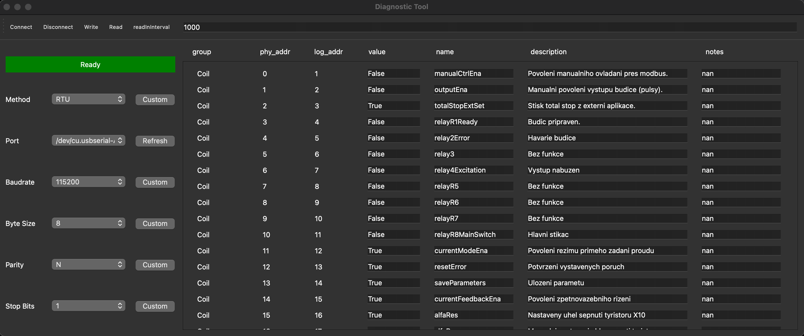

# Description

This application is designed for the company [PEG](https://peg.cz) and is written in Python. Its core functionalities are built using the [pymodbus](https://pymodbus.readthedocs.io/en/latest/) library for device communication and the [PyQt6](https://pypi.org/project/PyQt6/) library for the graphical user interface (GUI). The application facilitates reading and writing data from the device through a serial client. It is structured into four main components: the menubar, toolbar, communication, and values table.

> [!TIP]
> Using a MakeFile is recommended as it automates repetitive tasks such as building, testing, and deployment.

## Requirements

|Library|Version|
|:------|:------|
|pymodbus|v3.6.9|
|pandas|v2.2.2|
|pyserial|v3.5|
|numpy|v2.0.0|
|PyQt6|v.6.7.0|

## Setup

### MakeFile

```bash
make install
```

### Manual

#### Windows

```bash
pip install -r requirements.txt
```

#### MacOS/Linux

```bash
pip3 install -r requirements.txt
```

### Manual + .venv

> [!NOTE]
> Using venv isolates project dependencies, preventing conflicts and keeping your global Python environment clean.

#### Windows

```bash
python -m venv .venv
```

```bash
.venv/bin/pip3 install -r requirements.txt
```

#### MacOS/Linux

```bash
python3 -m venv .venv
```

```bash
.venv/bin/pip3 install -r requirements.txt
```

## Run

### MakeFile

> [!WARNING]
> It works only if you make setup throve **MakeFile** or **Manually + .venv**

```bash
make run
```

### Manual

> [!WARNING]
> It works only if you make setup **manually** as well.

#### Windows

```bash
python src/run.py
```

#### MacOS/Linux

```bash
python3 src/run.py
```

### Manual + .venv

> [!WARNING]
> It works only if you make setup throve **MakeFile** or **Manually + .venv**

#### Window/MacOS/Linux

```bash
.venv/bin/python3 src/run.py
```

## Clean
> [!IMPORTANT]
> Only if you were using **MakeFile** or **.venv**

### MakeFile

```bash
make clean
```

### Manual

#### Window/MacOS/Linux

```bash
.venv/bin/python3 src/run.py
```

## Example

